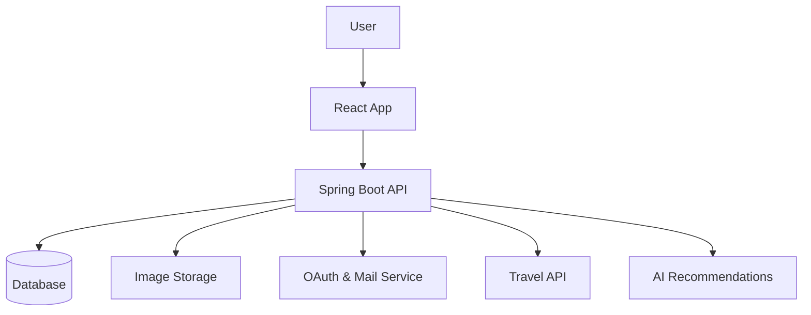

# ⚙️ Atlas Backend


> **Atlas Backend** is the powerful engine behind the **Atlas travel platform**, providing secure APIs, intelligent travel recommendations, and seamless integration with external services such as **Amadeus**, **Supabase**, and **Google Mail Service**.  
> Built for scalability, security, and speed with **Spring Boot 3** and **Java 21**.

---

## 👩‍💻 Developer
**Luisa Cerin Ogbeiwi**

---

## 🌍 Overview

The **Atlas Backend** is a robust and modular **Spring Boot application** that powers the entire Atlas ecosystem.  
It handles user authentication, travel data management, and AI-powered itinerary recommendations, integrating multiple third-party services to deliver a smooth and smart travel experience.

### 🔗 Integrations
- **Amadeus API** → Flight & activity data  
- **Supabase** → Secure file and image storage  
- **Google OAuth + JWT** → Authentication & authorization  
- **Google Mail Service** → Password reset via email  
- **Groq + OpenAI** → AI-driven travel recommendations  

---

## ✨ Features

- 🔐 **User Authentication:** Secure login & registration with **JWT** and **Google OAuth**
- 🧳 **Itinerary Management:** Create, update, and retrieve personalized itineraries
- 🤖 **AI-Powered Suggestions:** Generate smart travel plans via **Groq + OpenAI**
- ✈️ **Amadeus Integration:** Access flight and activity data in real time
- 🖼️ **File Storage:** Upload and manage images through **Supabase**
- 📧 **Password Reset:** Send recovery emails using **Google Mail Service**
- 🌐 **CORS Configuration:** Secure cross-origin communication with the frontend

---

## 🧩 Tech Stack

- **Language:** Java 21  
- **Framework:** Spring Boot 3  
- **Security:** Spring Security (JWT + Google OAuth)  
- **Database:** PostgreSQL  
- **AI Integration:** Groq + OpenAI  
- **Storage:** Supabase  
- **Mail Service:** Google Mail API  
- **Build Tool:** Maven  
- **Deployment:** Render  
- **Containerization:** Docker  

---

## 🚀 Getting Started

### ✅ Prerequisites
- Java 21 or higher  
- Maven  
- PostgreSQL  
- (Optional) Docker  

### 🏗️ Build and Run

1. Clone the repository:
   
   ```
   git clone https://github.com/browny26/atlas-backend.git 
   cd atlas-backend
   ```
   
3. Build the project:

   ```
   ./mvnw clean install
   ```

3. Run the application:

   ```
   ./mvnw spring-boot:run
   ```

5. The API will be available at:

   ```
   http://localhost:8080
   ```

## ⚙️ Configuration

All environment-specific configurations are defined in  
`src/main/resources/application.properties`

Update this file with your own credentials and API keys:  
- Database credentials  
- JWT secret key  
- Google OAuth credentials  
- Supabase URL and API key  
- Amadeus API key  

---

## 📡 API Endpoints

| Endpoint         | Description                         |
| ---------------- | ----------------------------------- |
| `/api/auth`      | Authentication & authorization      |
| `/api/user`      | User management                     |
| `/api/itinerary` | Create, edit & retrieve itineraries |
| `/api/amadeus`   | Integration with Amadeus travel API |
| `/api/storage`   | File upload & download via Supabase |

---

## 🧭 Architecture Overview

The backend follows a **modular layered architecture**, ensuring scalability and maintainability.



---

## 🗺️ Related Project

**[Atlas Frontend (React + Vite)](https://github.com/browny26/atlas-frontend)**

---

## 📄 License

This project is licensed under the **MIT License**.

---

## 💬 Contact

For questions or collaborations:  
📧 **Luisa Cerin Ogbeiwi**
